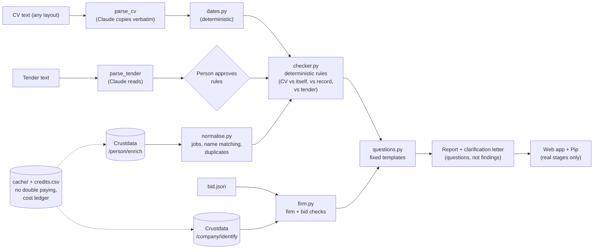

# TrueNorth: how it's built

```mermaid
flowchart LR
  T["Tender text"] --> PT["parse_tender<br/>(Claude reads)"] --> AP{"Person approves<br/>rules"}
  CV["CV text (any layout)"] --> PC["parse_cv<br/>(Claude copies verbatim)"] --> D["dates.py<br/>(deterministic)"]
  B["bid.json"] --> F
  D --> CHK
  AP --> CHK
  CD[("Crustdata<br/>/person/enrich")] --> N["normalise.py<br/>jobs, name matching,<br/>duplicates"] --> CHK
  CI[("Crustdata<br/>/company/identify")] --> F["firm.py<br/>firm + bid checks"]
  CHK["checker.py<br/>deterministic rules<br/>(CV vs itself, vs record,<br/>vs tender)"] --> Q["questions.py<br/>fixed templates"]
  F --> Q
  Q --> R["Report + clarification letter<br/>(questions, not findings)"]
  R --> UI["Web app + Pip<br/>(real stages only)"]
  CACHE[("cache/ + credits.csv<br/>no double paying,<br/>cost ledger")] -.-> CD
  CACHE -.-> CI
```

The only AI steps read text (CVs, tender). Every decision is made by tested, deterministic code.
